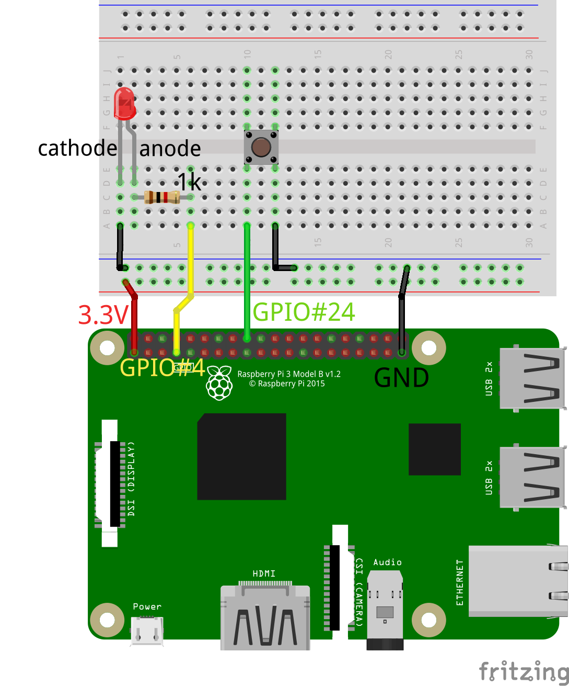

# A classic Blink project with variable speed
This project aims to close the loop between input and output on a Raspberry Pi board. Using a push-button we can change the LED blinking speed, in a circular way so that when the speed reaches the max value then it returns to the minimum at the next button press.

## Software
In order to use the GPIO, following suggestions given [here](https://www.kernel.org/doc/html/latest/driver-api/gpio/using-gpio.html), the *libgpiod* library has been linked. The program has one main function that inits all functionalities and then starts two separate threads, one for the input and another for the output. The input thread waits for a falling edge on the pin connected to the push-button; when the edge arrives the software changes the blinking speed in a circular fashion. The output thread just switches the LED on and off, with a delay imposed by a global variable that has been updated in the input thread.

## Hardware
The external circuit has been mounted on a prototype breadboard. For the output section there is an LED and a current limiting resistor connected to one GPIO's output pin. The input section has a push-button that, when it's pressed, forces a GPIO's input pin to ground. The Raspberry Pi internal pull-up resistor has been enabled, in this case.

  

