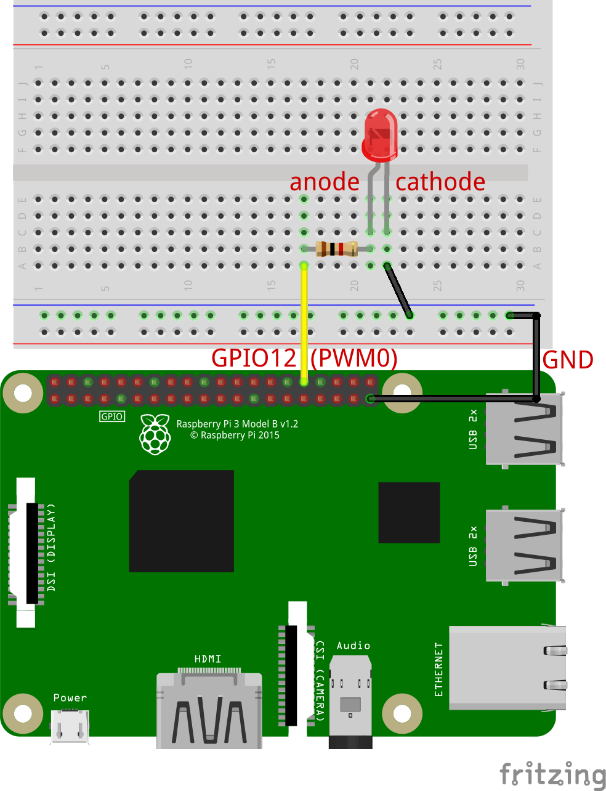

# PWM used to set LED brightness via sysfs
This project shows how to use PWM output on Raspberry Pi via appropriate calls to /sys/class/pwm/
## Presettings
Please note that in order to use PWM output on the 40 pin Raspberry Pi header we have to enable this functionality. One way is to add a line in the board configuration file */boot/config.txt* with the following content: 
```
# Configures PWM0 on pin 12: 12,4(Alt0)
dtoverlay=pwm,pin=12,func=4
```
In this manner we have GPIO12(PWM0), i.e. pin#32 on board header, set as PWM output. 
These settings have been taken from */boot/overlays/README* file (line 2176):
```
Name:   pwm
Info:   Configures a single PWM channel
        Legal pin,function combinations for each channel:
          PWM0: 12,4(Alt0) 18,2(Alt5) 40,4(Alt0)            52,5(Alt1)
          PWM1: 13,4(Alt0) 19,2(Alt5) 41,4(Alt0) 45,4(Alt0) 53,5(Alt1)
        N.B.:
          1) Pin 18 is the only one available on all platforms, and
             it is the one used by the I2S audio interface.
             Pins 12 and 13 might be better choices on an A+, B+ or Pi2.
          2) The onboard analogue audio output uses both PWM channels.
          3) So be careful mixing audio and PWM.
          4) Currently the clock must have been enabled and configured
             by other means.
Load:   dtoverlay=pwm,<param>=<val>
Params: pin                     Output pin (default 18) - see table
        func                    Pin function (default 2 = Alt5) - see above
        clock                   PWM clock frequency (informational)
```
These settings will take effect after a board reboot and will be permanent until you change */boot/config.txt* again.
## Hardware setup
The breadboard circuit mounting is very simple: you just have to connect GPIO12(PWM0) output (pin#32 of 40pins board header) to one LED in series with a 1k&Omega; resistor. To close the circuit add a wire between LED's cathode and the GND pin on the 40pins board header.
<p align="center">
  
</p>

## Software
The program sets PWM0 with the following values:
```
#define LOOP_DELAY 10E3         // us

#define PWM_PERIOD 10000000     // ns
#define DUTY_MIN 0              // ns
#define DUTY_MAX PWM_PERIOD     // ns
#define DUTY_DELTA 100000       // ns
```
PWM0 takes a period of 10000000ns, that is 10ms (100Hz). Duty-cycle goes from a minimum of 0% (LED off) to a maximum of 100% (LED full on), to a maximux again, for five times, with steps of 1%.
